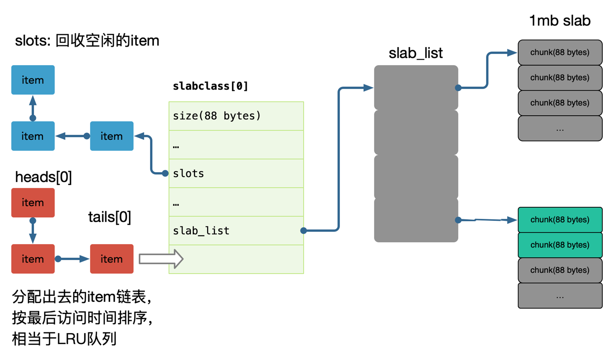

# 分布式缓存

## 缓存选型

### memcache

Memcache 提供简单的 kv cache 存储，value 大小不超过 1mb。

Memcache 使用了 slab 方式做内存管理，存在一定的浪费，如果大量接近的 item，建议调整 Memcache 参数来优化每一个 slab 增长的 ratio、可以通过设置 slab_automove 和 slab_reassign 开启 Memcache 的动态/手动 move slab，防止某些 slab 热点导致内存足够的情况下引发 LRU。

大部分情况下，简单 KV 推荐使用 Memcache，吞吐和响应都足够好。

每个 slab 包含若干大小为 1M 的内存页，这些内存又被分割成多个 chunk，每个 chunk 存储一个 item；

在 Memcache 启动初始化时，每个 slab 都预分配一个 1M 的内存页，由 slabs_preallocate 完成（也可将相应代码注释掉关闭预分配功能）。

chunk 的增长因子由 -f 指定，默认 1.25，起始大小为 48 字节。

---

学不进去啊，不学了！今天周五！
