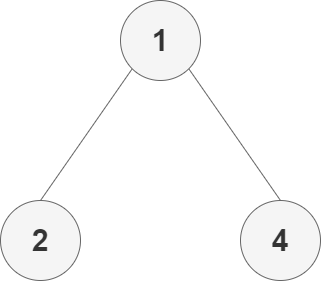
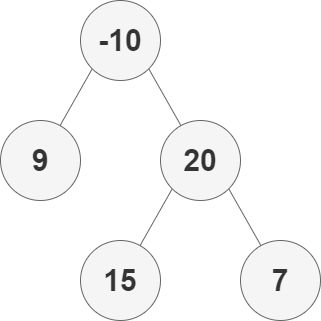

# 124. 二叉树中的最大路径和

## 题目

::: info 链接
[124. 二叉树中的最大路径和](https://leetcode.cn/problems/binary-tree-maximum-path-sum/)
:::

二叉树中的 **路径** 被定义为一条节点序列，序列中每对相邻节点之间都存在一条边。同一个节点在一条路径序列中 **至多出现一次** 。该路径 **至少包含一个** 节点，且不一定经过根节点。

**路径和** 是路径中各节点值的总和。

给你一个二叉树的根节点 `root` ，返回其 **最大路径和** 。

::: info 示例一
**输入**：root = [1,2,3]  
**输出**：6  
**解释**：最优路径是 2 -> 1 -> 3 ，路径和为 2 + 1 + 3 = 6

:::

::: info 示例二
**输入**：root = [-10,9,20,null,null,15,7]  
**输出**：42  
**解释**：最优路径是 15 -> 20 -> 7 ，路径和为 15 + 20 + 7 = 42

:::

## 题解

### 递归

求解分两步

1. 每个节点的最大贡献
2. 每个节点的最大路径和

定义贡献

1. 空节点的最大贡献值等于 0
2. 非空节点的最大贡献值等于节点值与其子节点中的最大贡献值之和（对于叶节点而言，最大贡献值等于节点值）

#### 每个节点的最大贡献

每个节点的最大贡献就是该节点的值与其左右子节点的最大贡献之和。

```go
var maxGain func(node *TreeNode) int
maxGain = func(node *TreeNode) int {
    if node == nil {
        return 0
    }

    left := max(maxGain(node.Left), 0)
    right := max(maxGain(node.Right), 0)

    return node.Val + max(left, right)
}
```

#### 每个节点的最大路径和

每个节点的最大路径和就是该节点的值与其左右子节点的最大贡献之和。

使用全局变量 `maxSum` 记录最大路径和。

```go
maxSum := math.MinInt32 // [!code hl]

var maxGain func(node *TreeNode) int
maxGain = func(node *TreeNode) int {
    if node == nil {
        return 0
    }

    left := max(maxGain(node.Left), 0)
    right := max(maxGain(node.Right), 0)

    priceNewPath := node.Val + left + right // [!code hl]

    if priceNewPath > maxSum { // [!code hl:3]
        maxSum = priceNewPath
    }

    return node.Val + max(left, right)
}
```

#### 完整代码

```go
/**
 * Definition for a binary tree node.
 * type TreeNode struct {
 *     Val int
 *     Left *TreeNode
 *     Right *TreeNode
 * }
 */
func maxPathSum(root *TreeNode) int {
    maxSum := math.MinInt32

    var maxGain func(node *TreeNode) int
    maxGain = func(node *TreeNode) int {
        if node == nil {
            return 0
        }

        left := max(maxGain(node.Left), 0)
        right := max(maxGain(node.Right), 0)

        priceNewPath := node.Val + left + right

        if priceNewPath > maxSum {
            maxSum = priceNewPath
        }

        return node.Val + max(left, right)
    }

    maxGain(root)
    return maxSum
}

func max(a, b int) int {
    if a > b {
        return a
    }
    return b
}
```
