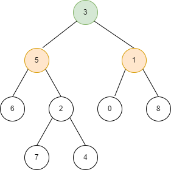
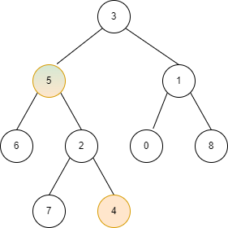

# 236. 二叉树的最近公共祖先

## 题目

::: info 链接
[236. 二叉树的最近公共祖先](https://leetcode.cn/problems/lowest-common-ancestor-of-a-binary-tree/)
:::

给定一个二叉树, 找到该树中两个指定节点的最近公共祖先。

::: info 示例一

**输入**：root = [3,5,1,6,2,0,8,null,null,7,4], p = 5, q = 1  
**输出**：3  
**解释**：节点 5 和节点 1 的最近公共祖先是节点 3 。



:::

::: info 示例二

**输入**：root = [3,5,1,6,2,0,8,null,null,7,4], p = 5, q = 4  
**输出**：5  
**解释**：节点 5 和节点 4 的最近公共祖先是节点 5 。因为根据定义最近公共祖先节点可以为节点本身。



:::

## 题解

### 递归

最近公共祖先 $x$ 有两种情况，

-   $p$ 和 $q$ 为 $x$ 的子节点
-   $p$ 为 $q$ 祖先或者 $q$ 为 $p$ 祖先

记 $f_x$ 为 $x$ 节点的后代节点包含 $p$ 或者 $q$，那么

$$
(f_l \&\& f_r) || ((x == p || x==q) \&\& (f_l || f_r))
$$

```go
/**
 * Definition for a binary tree node.
 * type TreeNode struct {
 *     Val int
 *     Left *TreeNode
 *     Right *TreeNode
 * }
 */
// lowestCommonAncestor returns the lowest common ancestor of two nodes in a binary tree.
// If one of the nodes is the ancestor of the other, it returns the ancestor node.
// If neither node is in the tree, it returns nil.
func lowestCommonAncestor(root, p, q *TreeNode) *TreeNode {
    // If the root is nil, return nil.
    if root == nil {
        return nil
    }

    // If the root is one of the nodes, return the root.
    if root.Val == p.Val || root.Val == q.Val {
        return root
    }

    // Recursively search for the nodes in the left and right subtrees.
    left := lowestCommonAncestor(root.Left, p ,q)
    right := lowestCommonAncestor(root.Right, p, q)

    // If both nodes are found in different subtrees, return the root.
    if left != nil && right != nil {
        return root
    }

    // If one of the nodes is not found in the left subtree, return the right subtree.
    if left == nil {
        return right
    }

    // If one of the nodes is not found in the right subtree, return the left subtree.
    return left
}
```
