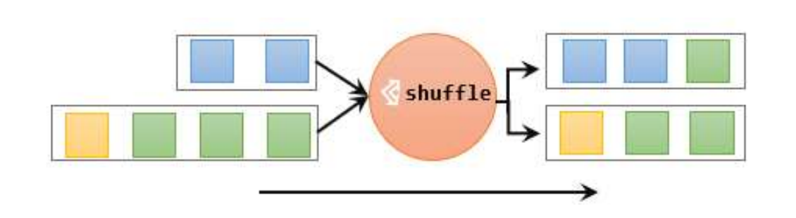
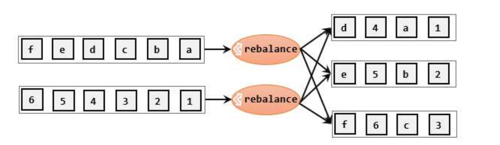
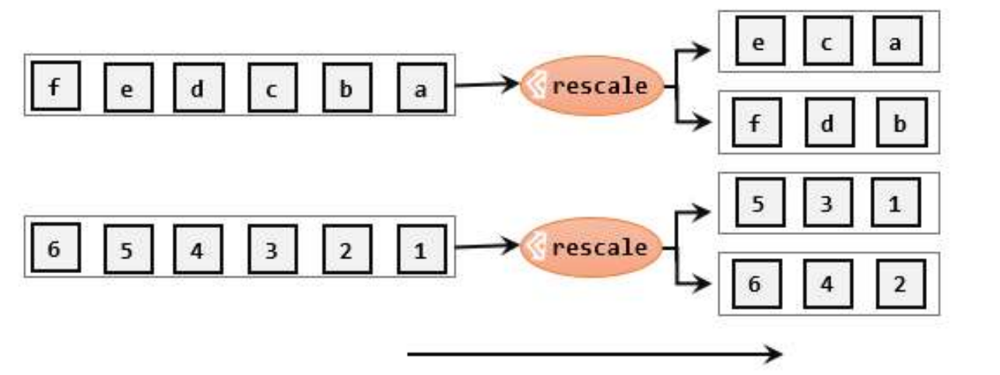

# Transformation 转换算子

数据源读入数据之后，我们就可以使用各种转换算子，将一个或多个 DataStream 转换为新的 DataStream。

## 基本转换算子（map/ filter/ flatMap）

### map 映射

map 主要用于将数据流中的数据进行转换，形成新的数据流。简单来说，就是一个“一一映射”，消费一个元素就产出一个元素。

我们只需要基于 DataStream 调用 `map()` 方法就可以进行转换处理。方法需要传入的参数是接口 `MapFunction` 的实现；返回值类型还是 DataStream，不过泛型（流中的元素类型）可能改变。

```java
package org.example.transformation;

import org.apache.flink.api.common.functions.MapFunction;
import org.apache.flink.streaming.api.datastream.DataStreamSource;
import org.apache.flink.streaming.api.environment.StreamExecutionEnvironment;
import org.example.bean.WaterSensor;

public class map {
    public static void main(String[] args) throws Exception {
        StreamExecutionEnvironment env = StreamExecutionEnvironment.getExecutionEnvironment();

        env.setParallelism(1);

        DataStreamSource<WaterSensor> streamSource = env.fromElements(
                new WaterSensor("sensor 1", 1L, 1),
                new WaterSensor("sensor 2", 2L, 2)
        );

        // // 方法一， 匿名类
        // streamSource.map(new MapFunction<WaterSensor, String>() {
        //     @Override
        //     public String map(WaterSensor waterSensor) throws Exception {
        //         return waterSensor.getId();
        //     }
        // })
        //         .print();

        // 方法二，Lambda
        // streamSource.map((MapFunction<WaterSensor, String>) WaterSensor::getId)
        //         .print();

        // 方法三，实现类
        streamSource.map(new UserMap())
                .print();

        env.execute();
    }

    // 实际应该单独建包
    public static class UserMap implements MapFunction<WaterSensor, String> {

        @Override
        public String map(WaterSensor waterSensor) throws Exception {
            return waterSensor.getId();
        }
    }
}
```

### filter 过滤

`filter` 转换操作，顾名思义是对数据流执行一个过滤，通过一个布尔条件表达式设置过滤条件，对于每一个流内元素进行判断，若为 `true` 则元素正常输出，若为 `false` 则元素被过滤掉。

进行 `filter` 转换之后的新数据流的数据类型与原数据流是相同的。filter 转换需要传入的参数需要实现 `FilterFunction` 接口，而 `FilterFunction` 内要实现 `filter()` 方法，就相当于一个返回布尔类型的条件表达式。

```java
// filter
streamSource.filter((FilterFunction<WaterSensor>) waterSensor -> waterSensor.getId().equals("sensor 1"));
        .print();
```

### flatMap 扁平映射

`flatMap` 操作又称为扁平映射，主要是将数据流中的整体（一般是集合类型）拆分成一个一个的个体使用。消费一个元素，可以产生 0 到多个元素。`flatMap` 可以认为是 扁平化 `flatten` 和映射 `map` 两步操作的结合，也就是先按照某种规则对数据进行打散拆分，再对拆分后的元素做转换处理。

同 `map` 一样，`flatMap` 也可以使用 `Lambda` 表达式或者 `FlatMapFunction` 接口实现类的方式来进行传参，返回值类型取决于所传参数的具体逻辑，可以与原数据流相同，也可以不同。

```java
// flatmap
streamSource.flatMap(new FlatMapFunction<WaterSensor, String>() {
            @Override
            public void flatMap(WaterSensor waterSensor, Collector<String> collector) throws Exception {
                if (waterSensor.getId().equals("sensor 1")) {
                    collector.collect(String.valueOf(waterSensor.vc));
                } else if (waterSensor.getId().equals("sensor 2")) {
                    collector.collect(String.valueOf(waterSensor.ts));
                    collector.collect(String.valueOf(waterSensor.vc));
                }
            }
        })
        .print();
```

## Aggregation 聚合算子

计算的结果不仅依赖当前数据，还跟之前的数据有关，相当于要把所有数据聚在一起进行汇总合并——这就是所谓的“聚合”（Aggregation），类似于 MapReduce 中的 reduce 操作。

### keyBy 按键分区

对于 Flink 而言，`DataStream` 是没有直接进行聚合的 API 的。因为我们对海量数据做聚合肯定要进行分区并行处理，这样才能提高效率。所以在 Flink 中，要做聚合，需要先进行分区；这个操作就是通过 `keyBy` 来完成的

`keyBy` 是聚合前必须要用到的一个算子。keyBy 通过指定键（key），可以将一条流从逻辑上划分成不同的分区（partitions）。这里所说的分区，其实就是并行处理的子任务。

基于不同的 key，流中的数据将被分配到不同的分区中去；这样一来，所有具有相同的 key 的数据，都将被发往同一个分区。

在内部，是通过计算 key 的哈希值（hash code），对分区数进行取模运算来实现的。所以这里 key 如果是 POJO 的话，必须要重写 `hashCode()` 方法。

`keyBy()` 方法需要传入一个参数，这个参数指定了一个或一组 key。有很多不同的方法来指定 key：比如对于 Tuple 数据类型，可以指定字段的位置或者多个位置的组合；对于 POJO 类型，可以指定字段的名称 `String` ；另外，还可以传入 Lambda 表达式或者实现一个键选择器 `KeySelector`，用于说明从数据中提取 key 的逻辑。

```java
// keyBy
streamSource.keyBy(WaterSensor::getId)
        .print();
```

::: info KeyedStream
需要注意的是，`keyBy` 得到的结果将不再是 `DataStream`，而是会将 `DataStream` 转换为 `KeyedStream`。`KeyedStream` 是对 `DataStream` 按照 key 的一个 **逻辑分区**，所以泛型有两个类型：当前流中的元素类型外，key 的类型。

`KeyedStream` 也继承自 `DataStream`，所以基于它的操作也都归属于 DataStream API。但它跟之前的转换操作得到的 `SingleOutputStreamOperator` 不同，只是一个流的分区操作，并不是一个转换算子。`KeyedStream` 是一个非常重要的数据结构，只有基于它才可以做后续的聚合操作（比如 `sum`，`reduce`）。
:::

### sum/min/max/minBy/maxBy 简单聚合

有了按键分区的数据流 `KeyedStream`，我们就可以基于它进行聚合操作了。Flink 为我们内置实现了一些最基本、最简单的聚合 API，主要有以下几种：

- `sum()`: 在输入流上，对指定的字段做叠加求和的操作。
- `min()`: 在输入流上，对指定的字段求最小值。
- `max()`: 在输入流上，对指定的字段求最大值。
- `minBy()`: 与 `min()` 类似，在输入流上针对指定字段求最小值。不同的是，`min()` 只计算指定字段的最小值，其他字段会保留最初第一个数据的值；而 `minBy()`则会返回包含字段最小值的整条数据。
- `maxBy()`: 与 `max()` 类似，在输入流上针对指定字段求最大值。两者区别与 `min()`/`minBy()` 完全一致。

简单聚合算子使用非常方便，语义也非常明确。这些聚合方法调用时，也需要传入参数；但并不像基本转换算子那样需要实现自定义函数，只要说明聚合指定的字段就可以了。指定字段的方式有两种：

- 指定位置
- 指定名称

::: info 注意
需要注意的是，元组中字段的名称，是以 f0、f1、f2、…来命名的。
:::

```java
// max
streamSource.keyBy(WaterSensor::getId)
        .max("vc")
        .print();
```

简单聚合算子返回的，同样是一个 `SingleOutputStreamOperator`，也就是从 `KeyedStream` 又转换成了常规的 `DataStream`。所以可以这样理解：`keyBy` 和`聚合` 是成对出现的，先分区、后聚合，得到的依然是一个 `DataStream`。而且经过简单聚合之后的数据流，元素的数据类型保持不变。

::: tip `min` 和 `minBy` 的区别
`min` 非比较字段不变，`minBy` 非比较字段变化。
:::

一个聚合算子，会为每一个 key 保存一个聚合的值，在 Flink 中我们把它叫作“状态”（state）。所以每当有一个新的数据输入，算子就会更新保存的聚合结果，并发送一个带有更新后聚合值的事件到下游算子。对于无界流来说，这些状态是永远不会被清除的，所以我们使用聚合算子，应该只用在含有有限个 key 的数据流上。

### reduce 归约聚合

`reduce` 可以对已有的数据进行归约处理，把每一个新输入的数据和当前已经归约出来的值，再做一个聚合计算。

`reduce` 操作也会将 `KeyedStream` 转换为 `DataStream`。它不会改变流的元素数据类型，所以输出类型和输入类型是一样的。

调用 `KeyedStream` 的 `reduce` 方法时，需要传入一个参数，实现 `ReduceFunction` 接口。

`ReduceFunction` 接口里需要实现 `reduce()` 方法，这个方法接收两个输入事件，经过转换处理之后输出一个相同类型的事件。在流处理的底层实现过程中，实际上是将中间“合并的结果”作为任务的一个状态保存起来的；之后每来一个新的数据，就和之前的聚合状态进一步做归约。

```java
public static void main(String[] args) throws Exception {
    StreamExecutionEnvironment env = StreamExecutionEnvironment.getExecutionEnvironment();

    env.setParallelism(1);

    DataStreamSource<WaterSensor> streamSource = env.fromElements(
            new WaterSensor("sensor 1", 1L, 1),
            new WaterSensor("sensor 1", 5L, 5),
            new WaterSensor("sensor 1", 33L, 33),
            new WaterSensor("sensor 2", 2L, 2),
            new WaterSensor("sensor 3", 3L, 3),
            new WaterSensor("sensor 4", 4L, 4)
    );

    KeyedStream<WaterSensor, String> keyedStream = streamSource.keyBy(WaterSensor::getId);

    keyedStream.reduce((ReduceFunction<WaterSensor>) (waterSensor, t1) -> {
                System.out.println("waterSensor.getId() = " + waterSensor.getId());
                System.out.println("t1.getTs() = " + t1.getTs());
                System.out.println("t1.getVc() = " + t1.getVc());
                return new WaterSensor(waterSensor.getId(), t1.getTs(), t1.getVc());
            })
            .print();

    env.execute();
}
```

结果

```java
WaterSensor{id='sensor 1', ts=1, vc=1}
waterSensor.getId() = sensor 1
t1.getTs() = 5
t1.getVc() = 5
WaterSensor{id='sensor 1', ts=5, vc=5}
waterSensor.getId() = sensor 1
t1.getTs() = 33
t1.getVc() = 33
WaterSensor{id='sensor 1', ts=33, vc=33}
WaterSensor{id='sensor 2', ts=2, vc=2}
WaterSensor{id='sensor 3', ts=3, vc=3}
WaterSensor{id='sensor 4', ts=4, vc=4}
```

`reduce` 同简单聚合算子一样，也要针对每一个 key 保存状态。因为状态不会清空，所以我们需要将 `reduce` 算子作用在一个有限 key 的流上。

## UDF 用户自定义函数

用户自定义函数（user-defined function，UDF），即用户可以根据自身需求，重新实现算子的逻辑。

用户自定义函数分为：函数类、匿名类、匿名函数、富函数类。

### Function Classes 函数类

Flink 暴露了所有 UDF 函数的接口，具体实现方式为接口或者抽象类，例如`MapFunction`、`FilterFunction`、`ReduceFunction` 等。所以用户可以自定义一个函数类，实现对应的接口。

### 匿名类

采用匿名类实现对应的接口。

### 匿名函数

采用匿名函数（Lambda）实现对应的接口。

### Rich Function Classes 富函数类

“富函数类”也是 DataStream API 提供的一个函数类的接口，所有的 Flink 函数类都有其 Rich 版 本 。 富 函 数 类 一 般 是 以 抽 象 类 的 形 式 出 现 的 。 例 如 ：`RichMapFunction`、`RichFilterFunction`、`RichReduceFunction` 等。

与常规函数类的不同主要在于，

1. 富函数类可以获取运行环境的上下文
2. 并拥有一些生命周期方法，所以可以实现更复杂的功能。

Rich Function 有生命周期的概念。典型的生命周期方法有：

- `open()`: 是 Rich Function 的初始化方法，也就是会开启一个算子的生命周期。
- `close()`: 是生命周期中的最后一个调用的方法，类似于结束方法。一般用来做一些清理工作。

需要注意的是，这里的生命周期方法，对于一个并行子任务来说只会调用一次；而对应的，实际工作方法，例如 `RichMapFunction` 中的 `map()`，在每条数据到来后都会触发一次调用。

## Physical Partitioning 物理分区算子

常见的物理分区策略有：随机分配（Random）、轮询分配（Round-Robin）、重缩放（Rescale）和广播（Broadcast）。

### shuffle 随机分区

最简单的重分区方式就是直接“洗牌”。通过调用 `DataStream` 的 `shuffle()` 方法，将数据随机地分配到下游算子的并行任务中去。

```java
streamSource.shuffle();
```

随机分区服从均匀分布（uniform distribution），所以可以把流中的数据随机打乱，均匀地传递到下游任务分区。因为是完全随机的，所以对于同样的输入数据, 每次执行得到的结果也不会相同。



经过随机分区之后，得到的依然是一个 DataStream。

### rebalance 轮询分区

轮询，简单来说就是“发牌”，按照先后顺序将数据做依次分发。通过调用 `DataStream` 的 `rebalance()` 方法，就可以实现轮询重分区。`rebalance` 使用的是 `Round-Robin` 负载均衡算法，可以将输入流数据平均分配到下游的并行任务中去。

```java
streamSource.rebalance();
```



### rescale 重缩放分区

重缩放分区和轮询分区非常相似。当调用 `rescale()` 方法时，其实底层也是使用 `Round-Robin` 算法进行轮询，但是只会将数据轮询发送到下游并行任务的一部分中。`rescale()` 的做法是分成小团体，发牌人只给自己团体内的所有人轮流发牌。

```java
streamSource.rescale();
```



### broadcast 广播

这种方式其实不应该叫做“重分区”，因为经过广播之后，数据会在不同的分区都保留一份，可能进行重复处理。可以通过调用 `broadcast()` 方法，将输入数据复制并发送到下游算子的所有并行任务中去。

```java
streamSource.broadcast();
```

### global 全局分区

全局分区也是一种特殊的分区方式。这种做法非常极端，通过调用 `global()` 方法，会将所有的输入流数据都发送到下游算子的第一个并行子任务中去。这就相当于强行让下游任务并行度变成了 1，所以使用这个操作需要非常谨慎，可能对程序造成很大的压力。

```java
streamSource.global();
```

### keyBy

按指定 key 发送，相同 key 发往同一个子任务。

### forward

one-to-one

### Custom 自定义分区

当 Flink 提供的所有分区策略都不能满足用户的需求时，我们可以通过使用 `partitionCustom()` 方法来自定义分区策略。

自定义分区器：

```java
public class MyPartitioner implements Partitioner<Long> {
    @Override
    public int partition(Long key, int numPartitions) {
        return (int) (key % numPartitions);
    }
}
```

使用自定义分区

```java
public static void main(String[] args) throws Exception {
    StreamExecutionEnvironment env = StreamExecutionEnvironment.getExecutionEnvironment();

    env.setParallelism(2);

    DataStreamSource<Long> streamSource = env.fromSequence(1, 100);

    streamSource.partitionCustom(new MyPartitioner(), value -> value).print();

    env.execute();
}
```

## 分流

所谓“分流”，就是将一条数据流拆分成完全独立的两条、甚至多条流。也就是基于一个 DataStream，定义一些筛选条件，将符合条件的数据拣选出来放到对应的流里。

### 简单实现

其实根据条件筛选数据的需求，本身非常容易实现：只要针对同一条流多次独立调用 `filter()` 方法进行筛选，就可以得到拆分之后的流了。

```java
public static void main(String[] args) throws Exception {
    StreamExecutionEnvironment env = StreamExecutionEnvironment.getExecutionEnvironment();

    SingleOutputStreamOperator<Integer> stream = env.fromSequence(1, 10).map(String::valueOf).map(Integer::valueOf);

    stream.filter(x -> x % 2 == 0).print("偶数");
    stream.filter(x -> x % 2 == 1).print("奇数");

    env.execute();
}
```

这段代码的实现虽然简单，但是代码有些冗余。处理逻辑对拆分出的三条流其实是一样的，但是重复写了三次。此外，这段代码的含义是将原始数据流复制三份，然后对每一份分别做筛选，这明显不够高效。因此，我们可以考虑使用一个算子来拆分流，而不是复制流。

### 使用侧输出流

绝大多数转换算子，输出的都是单一流，流里的数据类型只能有一种。而侧输出流可以认为是“主流”上分叉出的“支流”，所以可以由一条流产生出多条流，而且这些流中的数据类型还可以不一样。利用这个功能可以很容易地实现“分流”操作。

具体应用时，只要在处理函数的 `processElement()` 或者 `onTimer()` 方法中，调用上下文的 `output()` 方法就可以了。

简单来说，只需要调用上下文 ctx 的 `output()` 方法，就可以输出任意类型的数据了。而侧输出流的标记和提取，都离不开一个“输出标签”（`OutputTag`），指定了侧输出流的 id 和类型。

```java
public static void main(String[] args) throws Exception {
    StreamExecutionEnvironment env = StreamExecutionEnvironment.getExecutionEnvironment();

    DataStreamSource<WaterSensor> streamSource = env.fromElements(
            new WaterSensor("sensor 1", 1L, 1),
            new WaterSensor("sensor 1", 5L, 5),
            new WaterSensor("sensor 1", 33L, 33),
            new WaterSensor("sensor 2", 2L, 2),
            new WaterSensor("sensor 2", 3L, 3),
            new WaterSensor("sensor 4", 4L, 4)
    );

    OutputTag<WaterSensor> s1 = new OutputTag<WaterSensor>("sensor 1", Types.POJO(WaterSensor.class)) {
    };
    OutputTag<WaterSensor> s2 = new OutputTag<WaterSensor>("sensor 2", Types.POJO(WaterSensor.class)) {
    };

    // 返回的都是主流
    SingleOutputStreamOperator<WaterSensor> process = streamSource.process(new ProcessFunction<WaterSensor, WaterSensor>() {
        @Override
        public void processElement(WaterSensor value, ProcessFunction<WaterSensor, WaterSensor>.Context ctx, Collector<WaterSensor> out) throws Exception {
            if ("sensor 1".equals(value.getId())) {
                ctx.output(s1, value);
            } else if ("sensor 2".equals(value.getId())) {
                ctx.output(s2, value);
            } else {
                // 主流
                out.collect(value);
            }
        }
    });

    process.getSideOutput(s1).printToErr("s1");
    process.getSideOutput(s2).printToErr("s2");

    env.execute();
}
```
