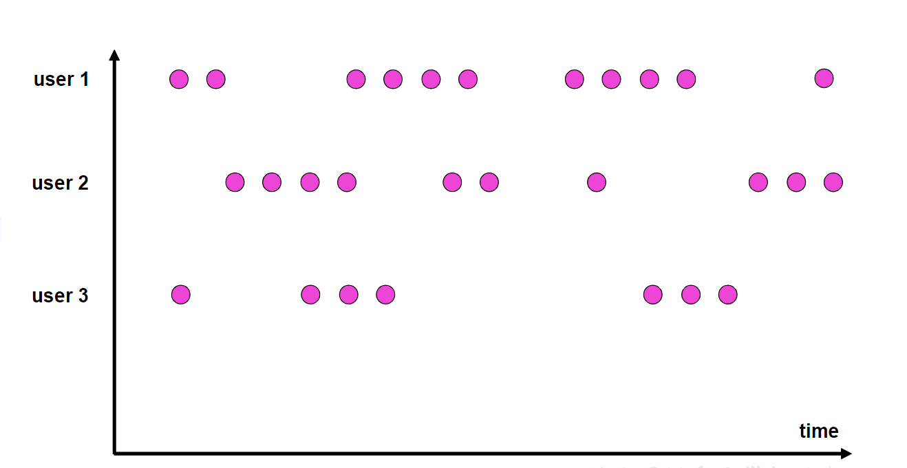

# 窗口 Window

## 概念

Flink 是一种流式计算引擎，主要是来处理无界数据流的，数据源源不断、无穷无尽。想要更加方便高效地处理无界流，一种方式就是将无限数据切割成有限的“数据块”进行处理，这就是所谓的“窗口”（Window）。

所谓的“窗口”，一般就是划定的一段范围，对在这范围内的数据进行处理，就是所谓的窗口计算。

在 Flink 中，窗口其实并不是一个“框”，应该把窗口理解成一个“桶”。在 Flink 中，窗口可以把流切割成有限大小的多个“存储桶”（bucket）；每个数据都会分发到对应的桶中，当到达窗口结束时间时，就对每个桶中收集的数据进行计算处理。


Flink 中窗口并不是静态准备好的，而是动态创建。当有落在这个窗口区间范围的数据达到时，才创建对应的窗口。另外，这里我们认为到达窗口结束时间时，窗口就触发计算并关闭，事实上“触发计算”和“窗口关闭”两个行为也可以分开。

## 分类

Flink 中内置的窗口的的分类：

### 按照驱动类型分

窗口本身是截取有界数据的一种方式，所以窗口一个非常重要的信息其实就是“怎样截取数据”。换句话说，就是以什么标准来开始和结束数据的截取，我们把它叫作窗口的“驱动类型”。

#### 时间窗口 Time Window

时间窗口以时间点来定义窗口的开始（start）和结束（end），所以截取出的就是某一时间段的数据。到达结束时间时，窗口不再收集数据，触发计算输出结果，并将窗口关闭销毁。

#### 计数窗口 CountWindow

计数窗口基于元素的个数来截取数据，到达固定的个数时就触发计算并关闭窗口。每个窗口截取数据的个数，就是窗口的大小。

### 按照窗口分配数据的规则分类

根据分配数据的规则，窗口的具体实现可以分为 4 类：

#### 滚动窗口 Tumbling Windows

滚动窗口有固定的大小，是一种对数据进行“均匀切片”的划分方式。窗口之间没有重叠，也不会有间隔，是“首尾相接”的状态。这是最简单的窗口形式，每个数据都会被分配到一个窗口，而且只会属于一个窗口。

滚动窗口可以基于时间定义，也可以基于数据个数定义；需要的参数只有一个，就 是 窗 口 的 大 小 （ windowSize）。

比如我们可以定义一个长度为 1 小时的滚动时间窗口，那么每个小时就会进行一次统计；
或者定义一个长度为 10 的滚动计数窗口，就会每 10 个数进行一次统计。

滚动窗口应用非常广泛，它可以对每个时间段做聚合统计，很多 BI 分析指标都可以用它来实现。


#### 滑动窗口 Sliding Windows

滑动窗口的大小也是固定的。但是窗口之间并不是首尾相接的，而是可以“错开”一定的位置。

定义滑动窗口的参数有两个：除去窗口大小（window size）之外，还有一个“滑动步长”（window slide），它其实就代表了窗口计算的频率。窗口在结束时间触发计算输出结果，那么滑动步长就代表了计算频率。

当滑动步长小于窗口大小时，滑动窗口就会出现重叠，这时数据也可能会被同时分配到多个窗口中。而具体的个数，就由窗口大小和滑动步长的比值（size/slide）来决定。

滚动窗口也可以看作是一种特殊的滑动窗口——窗口大小等于滑动步长（size = slide）。

滑动窗口适合计算结果更新频率非常高的场景。


#### 会话窗口 Session Windows

会话窗口，是基于“会话”（session）来来对数据进行分组的。会话窗口只能基于时间来定义。

会话窗口中，最重要的参数就是会话的超时时间，也就是两个会话窗口之间的最小距离。如果相邻两个数据到来的时间间隔（Gap）小于指定的大小（size），那说明还在保持会话，它们就属于同一个窗口；如果 gap 大于 size，那么新来的数据就应该属于新的会话窗口，而前一个窗口就应该关闭了。

会话窗口的长度不固定，起始和结束时间也是不确定的，各个分区之间窗口没有任何关联。会话窗口之间一定是不会重叠的，而且会留有至少为 size 的间隔（sessionGap）。

在一些类似保持会话的场景下，可以使用会话窗口来进行数据的处理统计。


#### 全局窗口 Global Windows

“全局窗口”，这种窗口全局有效，会把相同 key 的所有数据都分配到同一个窗口中。这种窗口没有结束的时候，默认是不会做触发计算的。如果希望它能对数据进行计算处理，还需要自定义“触发器”（Trigger）。

全局窗口没有结束的时间点，所以一般在希望做更加灵活的窗口处理时自定义使用。Flink 中的计数窗口（Count Window），底层就是用全局窗口实现的。



## API 概览

### 按键分区 Keyed 和非按键分区 Non-Keyed

在定义窗口操作之前，首先需要确定，到底是基于按键分区（Keyed）的数据流 KeyedStream 来开窗，还是直接在没有按键分区的 DataStream 上开窗。也就是说，在调用窗口算子之前，是否有 keyBy 操作。

#### 按键分区窗口 Keyed Windows

经过按键分区 keyBy 操作后，数据流会按照 key 被分为多条逻辑流（logical streams），这就是 KeyedStream。基于 KeyedStream 进行窗口操作时，窗口计算会在多个并行子任务上同时执行。相同 key 的数据会被发送到同一个并行子任务，而窗口操作会基于每个 key 进行单独的处理。所以可以认为，每个 key 上都定义了一组窗口，各自独立地进行统计计算。

```java
streamSource.keyBy(...)
        .window(...)
```

#### 非按键分区 Non-Keyed Windows

如果没有进行 keyBy，那么原始的 DataStream 就不会分成多条逻辑流。这时窗口逻辑只能在一个任务（task）上执行，就相当于并行度变成了 1。

::: warning 注意
`windowAll` 本身就是一个非并行的操作，手动调大窗口算子的并行度也是无效的。
:::

```java
streamSource.windowAll(...)
```

### 窗口 API 的调用

窗口操作主要有两个部分：窗口分配器（Window Assigners）和窗口函数（Window Functions）。

其中 `window()` 方法需要传入一个窗口分配器，它指明了窗口的类型；而后面的 `aggregate()` 方法传入一个窗口函数作为参数，它用来定义窗口具体的处理逻辑。窗口分配器有各种形式，而窗口函数的调用方法也不只 `aggregate()` 一种。

```java
stream.keyBy(<key selector>)
        .window(<window assigner>)
        .aggregate(<window function>)
```

## 窗口分配器 Window Assigners

定义窗口分配器（Window Assigners）是构建窗口算子的第一步，它的作用就是定义数据应该被“分配”到哪个窗口。所以可以说，窗口分配器其实就是在指定窗口的类型。

窗口分配器最通用的定义方式，就是调用 `window()` 方法。这个方法需要传入一个 `WindowAssigner` 作为参数，返回 `WindowedStream`。如果是非按键分区窗口，那么直接调用 `windowAll()` 方法，同样传入一个 `WindowAssigner`，返回的是 `AllWindowedStream`。

窗口按照驱动类型可以分成时间窗口和计数窗口，而按照具体的分配规则，又有滚动窗口、滑动窗口、会话窗口、全局窗口四种。除去需要自定义的全局窗口外，其他常用的类型 Flink 中都给出了内置的分配器实现，我们可以方便地调用实现各种需求。

### 时间窗口

时间窗口是最常用的窗口类型，可以细分为滚动、滑动和会话三种。

#### 滚动时间窗口

窗口分配器由类 `TumblingProcessingTimeWindows` / `TumblingEventTimeWindows` 提供，需要调用它的静态方法 `of()`。

需要传入一个 Time 类型的参数 size，表示滚动窗口的大小。

```java
stream.keyBy(...)
        .window(TumblingProcessingTimeWindows.of(Time.seconds(5)))
        .aggregate(...);
```

#### 滑动时间窗口

窗口分配器由类 `SlidingProcessingTimeWindows` / `SlidingEventTimeWindows` 提供，同样需要调用它的静态方法 `of()`。

需要传入两个 Time 类型的参数：size 和 slide，前者表示滑动窗口的大小，后者表示滑动窗口的滑动步长。

```java
stream.keyBy(...)
        .window(SlidingProcessingTimeWindows.of(Time.seconds(10), Time.seconds(5))))
        .aggregate(...);
```

#### 会话时间窗口

窗口分配器由类 `ProcessingTimeSessionWindows` / `EventTimeSessionWindows` 提供，需要调用它的静态方法 `withGap()` 或者 `withDynamicGap()`。

`withGap()` 方法需要传入一个 Time 类型的参数 size，表示会话的超时时间，也就是最小间隔 session gap。

`withDynamicGap()` 方法定义 session gap 的动态提取逻辑。

```java
stream.keyBy(...)
        .window(ProcessingTimeSessionWindows.withGap(Time.seconds(2)))
        .aggregate(...);
```

### 计数窗口

计数窗口概念非常简单，本身底层是基于全局窗口（Global Window）实现的。Flink 为我们提供了非常方便的接口：直接调用 `countWindow()` 方法。根据分配规则的不同，又可以分为滚动计数窗口和滑动计数窗口两类。

#### 滚动计数窗口

滚动计数窗口只需要传入一个长整型的参数 size，表示窗口的大小。

#### 滑动计数窗口

传入两个参数：size 和 slide，前者表示窗口大小，后者表示滑动步长。

## 窗口函数 Window Functions

定义了窗口分配器，我们只是知道了数据属于哪个窗口，可以将数据收集起来了；至于收集起来到底要做什么，其实还完全没有头绪。所以在窗口分配器之后，必须再接上一个定义窗口如何进行计算的操作，这就是所谓的“窗口函数”（window functions）。

窗口函数定义了要对窗口中收集的数据做的计算操作，根据处理的方式可以分为两类：增量聚合函数和全窗口函数。


### 增量聚合函数 ReduceFunction / AggregateFunction

窗口将数据收集起来，最基本的处理操作当然就是进行聚合。我们可以每来一个数据就在之前结果上聚合一次，这就是“增量聚合”。

#### 归约函数 ReduceFunction

很简单，直接看示例：

::: details 示例代码

```java
public class WindowReduce {
    public static void main(String[] args) throws Exception {
        StreamExecutionEnvironment env = StreamExecutionEnvironment.getExecutionEnvironment();
        env.setParallelism(1);

        DataStreamSource<Integer> stream = env.fromElements(1, 2, 3, 4, 5, 6);

        stream.keyBy(value -> value % 3)
                .countWindow(2)
                .reduce(new ReduceFunction<Integer>() {

                    @Override
                    public Integer reduce(Integer arg0, Integer arg1) throws Exception {
                        System.out.println("reduce: arg0: " + arg0 + " arg1: " + arg1);
                        return arg0 + arg1;
                    }

                })
                .print();

        env.execute();
    }
}
```

:::

#### 聚合函数 AggregateFunction

`ReduceFunction` 可以解决大多数归约聚合的问题，但是这个接口有一个限制，就是聚合状态的类型、输出结果的类型都必须和输入数据类型一样。

`aggregate` 就突破了这个限制，可以定义更加灵活的窗口聚合操作。这个方法需要传入一个 `AggregateFunction` 的实现类作为参数。

`AggregateFunction` 可以看作是 `ReduceFunction` 的通用版本，这里有三种类型：

- 输入类型（IN）：输入类型 IN 就是输入流中元素的数据类型；
- 累加器类型（ACC）：累加器类型 ACC 则是我们进行聚合的中间状态类型；
- 输出类型（OUT）：输出类型当然就是最终计算结果的类型了。

接口中有四个方法：

- `createAccumulator()`：创建一个累加器，这就是为聚合创建了一个初始状态，每个聚合任务只会调用一次。
- `add()`：将输入的元素添加到累加器中。
- `getResult()`：从累加器中提取聚合的输出结果。
- `merge()`：合并两个累加器，并将合并后的状态作为一个累加器返回。

所以可以看到，`AggregateFunction` 的工作原理是：首先调用 `createAccumulator()` 为任务初始化一个状态（累加器）；而后每来一个数据就调用一次 `add()` 方法，对数据进行聚合，得到的结果保存在状态中；等到了窗口需要输出时，再调用 `getResult()` 方法得到计算结果。很明显，与 `ReduceFunction` 相同，`AggregateFunction` 也是增量式的聚合；而由于输入、中间状态、输出的类型可以不同，使得应用更加灵活方便。

::: details 示例代码

```java

public class WindowReduce {
    public static void main(String[] args) throws Exception {
        StreamExecutionEnvironment env = StreamExecutionEnvironment.getExecutionEnvironment();
        env.setParallelism(1);

        DataStreamSource<Integer> stream = env.fromElements(1, 2, 3, 4, 5, 6);

        stream.keyBy(value -> value % 3)
                .countWindow(2)
                .aggregate(new AggregateFunction<Integer, Integer, String>() {

                    @Override
                    public Integer createAccumulator() {
                        System.out.println("创建累加器");
                        return 0;
                    }

                    @Override
                    public Integer add(Integer value, Integer accumulator) {
                        System.out.println(" 调用 add 方法, value = " + value);
                        return value + accumulator;
                    }

                    @Override
                    public String getResult(Integer accumulator) {
                        System.out.println("调用 getResult 方法");
                        return accumulator.toString();
                    }

                    @Override
                    public Integer merge(Integer a, Integer b) {
                        System.out.println("调用 merge 方法");
                        return null;
                    }

                })
                .print();

        env.execute();
    }
}
```

:::

#### 简单聚合方法

另外，Flink 也为窗口的聚合提供了一系列预定义的简单聚合方法，可以直接基于 `WindowedStream` 调用。主要包括 `sum()`/`max()`/`maxBy()`/`min()`/`minBy()`，与 `KeyedStream` 的简单聚合非常相似。它们的底层，其实都是通过 `AggregateFunction` 来实现的。

### 全窗口函数 full window functions

有些场景下，我们要做的计算必须基于全部的数据才有效，这时做增量聚合就没什么意义了；另外，输出的结果有可能要包含上下文中的一些信息（比如窗口的起始时间），这是增量聚合函数做不到的。

所以，我们还需要有更丰富的窗口计算方式。窗口操作中的另一大类就是全窗口函数。与增量聚合函数不同，全窗口函数需要先收集窗口中的数据，并在内部缓存起来，等到窗口要输出结果的时候再取出数据进行计算。

在 Flink 中，全窗口函数也有两种：`WindowFunction` 和 `ProcessWindowFunction`。

#### 窗口函数 WindowFunction

`WindowFunction` 字面上就是“窗口函数”，它其实是老版本的通用窗口函数接口。我们可以基于 `WindowedStream` 调用 `apply()` 方法，传入一个 `WindowFunction` 的实现类。

`WindowFunction` 能提供的上下文信息较少，也没有更高级的功能。事实上，它的作用可以被 `ProcessWindowFunction` 全覆盖，所以之后可能会逐渐 _弃用_ 。

#### 处理窗口函数 ProcessWindowFunction

`ProcessWindowFunction` 是 Window API 中最底层的通用窗口函数接口。之所以说它“最底层”，是因为除了可以拿到窗口中的所有数据之外，`ProcessWindowFunction` 还可以获取到一个“上下文对象”（Context）。这个上下文对象非常强大，不仅能够获取窗口信息，还可以访问当前的时间和状态信息。这里的时间就包括了处理时间（processing time）和事件时间水位线（event time watermark）。这就使得 `ProcessWindowFunction` 更加灵活、功能更加丰富，其实就是一个增强版的 `WindowFunction`。

事实上，`ProcessWindowFunction` 是 Flink 底层 API——处理函数（process function）中的一员。

::: details 示例代码

```java
public class ProcessWindowFunctionDemo {
    public static void main(String[] args) throws Exception {
        StreamExecutionEnvironment env = StreamExecutionEnvironment.getExecutionEnvironment();
        env.setParallelism(1);

        DataStreamSource<Integer> stream = env.fromElements(1, 2, 3, 4, 5, 6);

        stream.keyBy(value -> value % 3)
                // .window(TumblingProcessingTimeWindows.of(Time.milliseconds(2)))
                .countWindow(2)
                .process(new ProcessWindowFunction<Integer, String, Integer, GlobalWindow>() {

                    @Override
                    public void process(Integer key,
                            ProcessWindowFunction<Integer, String, Integer, GlobalWindow>.Context context,
                            Iterable<Integer> elements, Collector<String> out) throws Exception {
                        long count = elements.spliterator().estimateSize();

                        out.collect("key=" + key + "的窗口包含" + count + "条数据 ==> "
                                + elements.toString());
                    }

                })
                .print();

        env.execute();
    }
}
```

:::

### 增量聚合和全窗口函数的结合使用

在实际应用中，我们往往希望兼具这两者的优点，把它们结合在一起使用。Flink 的 Window API 就给我们实现了这样的用法。

我们之前在调用 `WindowedStream` 的 `reduce()` 和 `aggregate()` 方法时，只是简单地直接传入了一个 `ReduceFunction` 或 `AggregateFunction` 进行增量聚合。除此之外，其实还可以传入第二个参数：一个全窗口函数，可以是 `WindowFunction` 或者 `ProcessWindowFunction`。

这样调用的处理机制是：基于第一个参数（增量聚合函数）来处理窗口数据，每来一个数据就做一次聚合；等到窗口需要触发计算时，则调用第二个参数（全窗口函数）的处理逻辑输出结果。需要注意的是，这里的全窗口函数就不再缓存所有数据了，而是直接将增量聚合函数的结果拿来当作了 Iterable 类型的输入。

增量聚合 `Aggregate` + 全窗口 `process`

1. 增量聚合函数处理数据： 来一条计算一条
2. 窗口触发时， 增量聚合的结果（只有一条） 传递给 全窗口函数
3. 经过全窗口函数的处理包装后，输出

结合两者的优点：

1. 增量聚合： 来一条计算一条，存储中间的计算结果，占用的空间少
2. 全窗口函数： 可以通过 上下文 实现灵活的功能

## 其他 API

对于一个窗口算子而言，窗口分配器和窗口函数是必不可少的。除此之外，Flink 还提供了其他一些可选的 API，让我们可以更加灵活地控制窗口行为。

### 触发器 Trigger

触发器主要是用来控制窗口什么时候触发计算。所谓的“触发计算”，本质上就是执行窗口函数，所以可以认为是计算得到结果并输出的过程。基于 `WindowedStream` 调用 `trigger()` 方法，就可以传入一个自定义的窗口触发器（Trigger）

### 移除器 Evictor

移除器主要用来定义移除某些数据的逻辑。基于 `WindowedStream` 调用 `evictor()` 方法，就可以传入一个自定义的移除器（Evictor）。Evictor 是一个接口，不同的窗口类型都有各自预实现的移除器。
