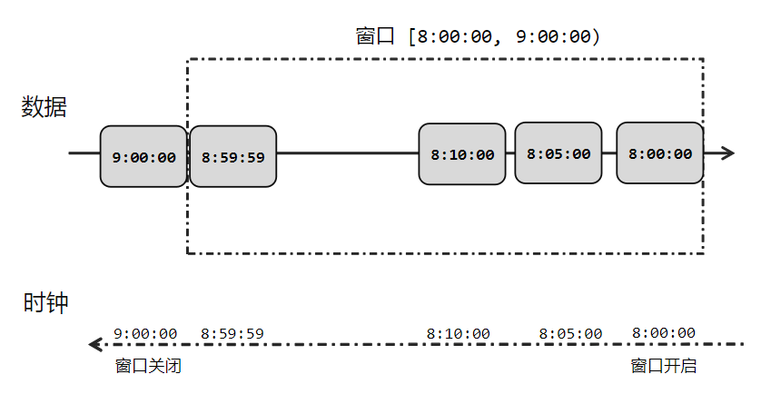
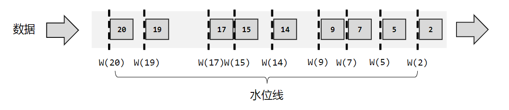
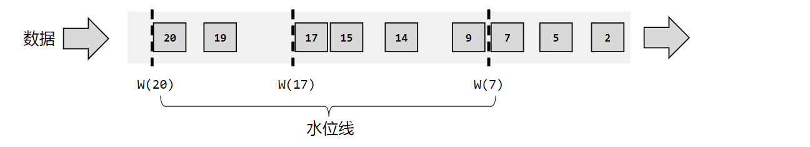
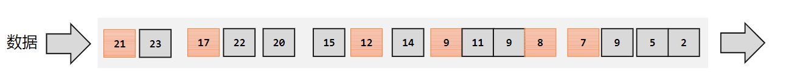
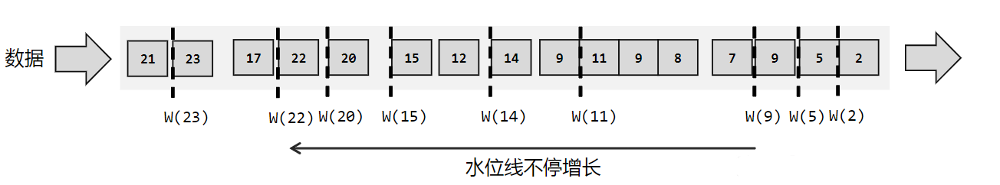
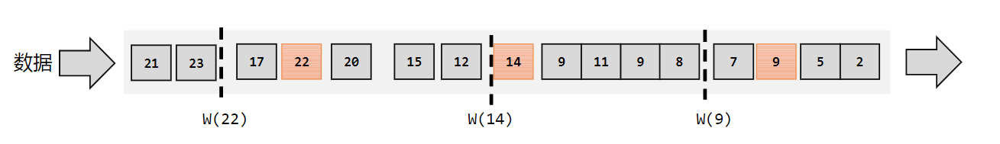
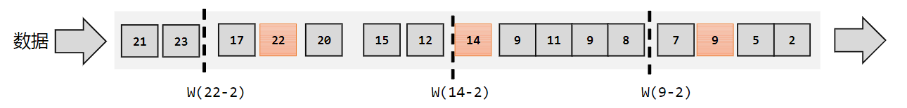

# 水位线 Watermark

## 时间语义

在实际应用中，事件时间语义会更为常见。一般情况下，业务日志数据中都会记录数据生成的时间戳（timestamp），它就可以作为事件时间的判断基础。 在 Flink 中，由于处理时间比较简单，早期版本默认的时间语义是处理时间；而考虑到事件时间在实际应用中更为广泛，从 Flink1.12 版本开始，Flink 已经将事件时间作为默认的时间语义了。

## 事件时间和窗口

在窗口的处理过程中，我们可以基于数据的时间戳，自定义一个“逻辑时钟”。这个时钟的时间不会自动流逝；它的时间进展，就是靠着新到数据的时间戳来推动的。

这样的好处在于，计算的过程可以完全不依赖处理时间（系统时间），不论什么时候进行统计处理，得到的结果都是正确的。而一般实时流处理的场景中，事件时间可以基本与处理时间保持同步，只是略微有一点延迟，同时保证了窗口计算的正确性。

## 水位线

在 Flink 中，用来衡量事件时间进展的标记，就被称作“水位线”（Watermark）。

具体实现上，水位线可以看作一条特殊的数据记录，它是插入到数据流中的一个标记点，主要内容就是一个时间戳，用来指示当前的事件时间。而它插入流中的位置，就应该是在某个数据到来之后；这样就可以从这个数据中提取时间戳，作为当前水位线的时间戳了。

### 有序流中的水位线

理想状态，数据应该按照生成的先后顺序进入流中，每条数据产生一个水位线；

实际应用中，如果当前数据量非常大，且同时涌来的数据时间差会非常小（比如几毫秒），往往对处理计算也没什么影响。所以为了提高效率，一般会每隔一段时间生成一个水位线。

### 乱序流中的水位线

在分布式系统中，数据在节点间传输，会因为网络传输延迟的不确定性，导致顺序发生改变，这就是所谓的“乱序数据”。

我们还是靠数据来驱动，每来一个数据就提取它的时间戳、插入一个水位线。不过现在的情况是数据乱序，所以插入新的水位线时，要先判断一下时间戳是否比之前的大，否则就不再生成新的水位线。也就是说，只有数据的时间戳比当前时钟大，才能推动时钟前进，这时才插入水位线。

如果考虑到大量数据同时到来的处理效率，我们同样可以周期性地生成水位线。这时只需要保存一下之前所有数据中的最大时间戳，需要插入水位线时，就直接以它作为时间戳生成新的水位线。

我们无法正确处理“迟到”的数据。为了让窗口能够正确收集到迟到的数据，我们也可以等上一段时间，比如 2 秒；也就是用当前已有数据的最大时间戳减去 2 秒，就是要插入的水位线的时间戳。这样的话，9 秒的数据到来之后，事件时钟不会直接推进到 9 秒，而是进展到了 7 秒；必须等到 11 秒的数据到来之后，事件时钟才会进展到 9 秒，这时迟到数据也都已收集齐，0~9 秒的窗口就可以正确计算结果了。

现在我们可以知道，水位线就代表了当前的事件时间时钟，而且可以在数据的时间戳基础上加一些延迟来保证不丢数据，这一点对于乱序流的正确处理非常重要。

## 水位线特性

- 水位线是插入到数据流中的一个标记，可以认为是一个特殊的数据
- 水位线主要的内容是一个时间戳，用来表示当前事件时间的进展
- 水位线是基于数据的时间戳生成的
- 水位线的时间戳必须单调递增，以确保任务的事件时间时钟一直向前推进
- 水位线可以通过设置延迟，来保证正确处理乱序数据
- 一个水位线 Watermark(t)，表示在当前流中事件时间已经达到了时间戳 t，这代表 t 之前的所有数据都到齐了，之后流中不会出现时间戳 t’≤ t 的数据

水位线是 Flink 流处理中保证结果正确性的核心机制，它往往会跟窗口一起配合，完成对乱序数据的正确处理。
