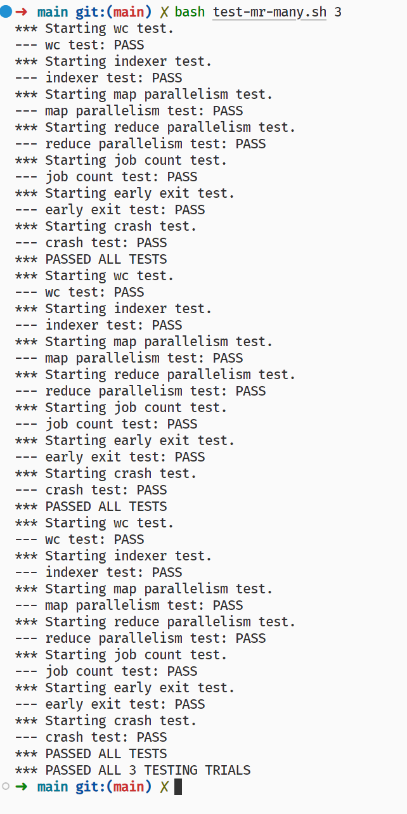
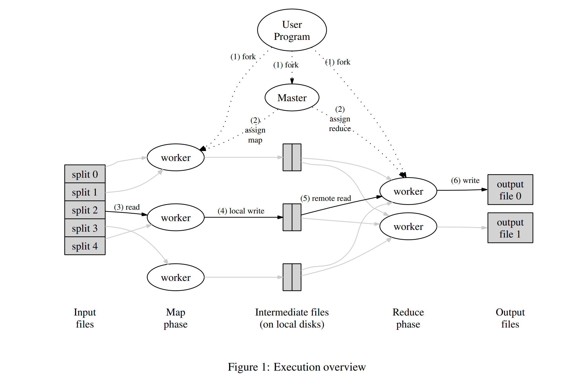

# 6.5840 Lab 1: MapReduce 第二天

::: details 前言
写完了！

:::

## `MapReduce` 总览



## 测试文件梳理

分析测试文件

### 词频统计

```bash
sort mr-out* | grep . > mr-wc-all
cmp mr-wc-all mr-correct-wc.txt
```

### 索引建立

```bash
sort mr-out* | grep . > mr-indexer-all
cmp mr-indexer-all mr-correct-indexer.txt
```

### `map` 并行度测试

1. 运行 MapReduce 作业,使用一个特殊的应用程序记录 Map 任务的启动时间
2. 统计时间戳数,验证是否与预期的并行数(这里是 2)一致
3. 检查输出是否包含 parallel 字样,进一步验证 Map 任务是否真的并行执行

### `reduce` 并行度测试

同上

### 作业计数功能

1. 运行一个可以统计 Map 任务次数的特殊应用
2. 用 awk 提取统计结果(计数值)
3. 与预期值(这里是 8 = 4 文件 \* 2 次 Map 每个文件)比对
4. 相等则通过,不等则失败

### 测试 `Worker` 或 `Coordinator` 是否会在作业完成前提前退出

1. 运行 early_exit 插件会在部分任务结束时触发退出
2. 记录初期输出并等待作业结束
3. 对比初期和最终输出,是否有差异

### 测试是否可以容忍 Worker 崩溃后继续工作并得到正确结果

1. 记录正确输出
2. 用 crash 插件随机崩溃 einzelne worker
3. 同时有多个 worker 轮流运行
4. 等待作业结束并对比最终输出

## 实现

::: warning 注意
我删除了之前的错误代码，使页面整洁
:::

写到这里发现遇到了问题，我没有办法通知 `coordinator` 我已经完成了任务。而且我稍微理解了一点项目，索性直接重构。

### 功能梳理

#### `worker` 功能

1. 申请任务
2. 执行任务
3. 重复 1-2
4. 退出

#### `coordinator` 功能

1. 分配任务
2. 等待任务完成
3. 重复 1-2

### `worker` 完善

`for` 循环里不同重复申请，执行，通知任务完成。

::: details 源代码

```go
// main/mrworker.go calls this function.
func Worker(mapf func(string, string) []KeyValue,
	reducef func(string, []string) string) {
	for {
		// 申请任务
		// 执行任务
	}
}
```

:::

从 `worker` 的角度出发，`worker` 申请到的任务有四种类型，`MapTask`，`ReduceTask`，`WaitTask`，`DoneTask`。

其中有两种基本状态，以及 `WaitTask` 和 `DoneTask`，分别表示等待（其他）任务完成和所有任务完成。

`worker` 向 `coordinator` 发送 rpc 请求 "Coordinator.AssignTask" 得到一个 `Task` 任务。

然后根据 `Task` 的类型执行不同的操作。

1. `MapTask`：执行 `map` 任务，将结果写入中间文件，然后通知 `coordinator` 任务完成
2. `ReduceTask`：执行 `reduce` 任务，将结果写入最终文件，然后通知 `coordinator` 任务完成
3. `WaitTask`：等待
4. `DoneTask`：退出

通知任务完成进行 rpc 请求 "Coordinator.TaskDone"。

::: details 源代码

```go [rpc.go]
type TaskType int

const (
	MapTask TaskType = iota
	ReduceTask
	WaitTask
	DoneTask
)

type AssignTaskArgs struct {
}

type AssignTaskReply struct {
	*Task
}

type TaskDoneArgs struct {
}

type TaskDoneReply struct {
}
```

```go [worker.go]
// main/mrworker.go calls this function.
func Worker(mapf func(string, string) []KeyValue,
	reducef func(string, []string) string) {
	for {
		// 申请任务
		task := getTask()
		// 执行任务
		switch task.TaskType {
		case MapTask:
			//  log.Printf("MapTask\n")
			doMap(task, mapf)
			taskDone(task)
		case ReduceTask:
			//  log.Printf("ReduceTask\n")
			doReduce(task, reducef)
			taskDone(task)
		case WaitTask:
			//  log.Printf("WaitTask\n")
			time.Sleep(time.Millisecond * 500)
		case DoneTask:
			//  log.Printf("DoneTask\n")
			return
		}
	}
}

func getTask() *Task {
	args := &AssignTaskArgs{}
	reply := &AssignTaskReply{}
	call("Coordinator.AssignTask", args, reply)
	return reply.Task
}

func doMap(task *Task, mapf func(string, string) []KeyValue) {
	// ...
}

func doReduce(task *Task, reducef func(string, []string) string) {
	// ...
}

func taskDone(task *Task) {
	args := &TaskDoneArgs{}
	reply := &TaskDoneReply{}
	call("Coordinator.TaskDone", args, reply)
}
```

:::

`worker` 的工作基本完成。

接下来只需要完善 `doMap()` 和 `doReduce()` 即可。

::: details 源代码

::: code-group

```go [doMap]
func doMap(task *Task, mapf func(string, string) []KeyValue) {
	filename := task.MapInputFile
	file, err := os.Open(filename)
	if err != nil {
		//  log.Fatalf("cannot open %v", filename)
	}
	content, err := io.ReadAll(file)
	if err != nil {
		//  log.Fatalf("cannot read %v", filename)
	}
	file.Close()
	kva := mapf(filename, string(content))
	intermediate := make([][]KeyValue, task.NReduce)
	for _, kv := range kva {
		index := ihash(kv.Key) % task.NReduce
		if intermediate[index] == nil {
			intermediate[index] = make([]KeyValue, 0)
		}
		intermediate[index] = append(intermediate[index], kv)
	}

	for key, v := range intermediate {
		// 将 JSON 数据写入文件
		filename := fmt.Sprintf("mr-%d-%d", task.ID, key)
		file, err := os.Create(filename)
		if err != nil {
			fmt.Println("File creation failed:", err)
			return
		}
		defer file.Close()
		// 创建 JSON 编码器
		encoder := json.NewEncoder(file)

		// 将数据编码为 JSON 并写入文件
		err = encoder.Encode(v)
		if err != nil {
			fmt.Println("JSON encoding failed:", err)
			return
		}
	}
}
```

```go [doReduce]
// for sorting by key.
type ByKey []KeyValue

// for sorting by key.
func (a ByKey) Len() int           { return len(a) }
func (a ByKey) Swap(i, j int)      { a[i], a[j] = a[j], a[i] }
func (a ByKey) Less(i, j int) bool { return a[i].Key < a[j].Key }

func doReduce(task *Task, reducef func(string, []string) string) {
	intermediate := []KeyValue{}
	for i := 0; i < task.MMap; i++ {
		filename := fmt.Sprintf("mr-%d-%d", i, task.ID)
		file, err := os.Open(filename)
		if err != nil {
			fmt.Println("File open failed:", err)
			return
		}
		defer file.Close()

		var kva []KeyValue

		// 创建 JSON 解码器
		decoder := json.NewDecoder(file)

		err = decoder.Decode(&kva)
		if err != nil {
			fmt.Println("JSON decoding failed:", err)
			return
		}

		intermediate = append(intermediate, kva...)
	}

	sort.Sort(ByKey(intermediate))

	oname := fmt.Sprintf("mr-out-%d", task.ID)
	ofile, _ := os.Create(oname)
	defer ofile.Close()
	i := 0
	for i < len(intermediate) {
		j := i + 1
		for j < len(intermediate) && intermediate[j].Key == intermediate[i].Key {
			j++
		}
		values := []string{}
		for k := i; k < j; k++ {
			values = append(values, intermediate[k].Value)
		}
		output := reducef(intermediate[i].Key, values)

		// this is the correct format for each line of Reduce output.
		fmt.Fprintf(ofile, "%v %v\n", intermediate[i].Key, output)

		i = j
	}
}
```

:::

### `coordinator` 完善

::: details 源代码

::: code-group

```go [状态]
type coordinatorStatus int

const (
Idle coordinatorStatus = iota
Map
WaitMap
Reduce
WaitReduce
Done
)

```

```go [结构体]
const timeout = time.Second * 5

type Coordinator struct {
	status         coordinatorStatus
	tasks          sync.Map
	availableTasks chan *Task
	nReduce        int
	mMap           int
	done           chan bool
}
```

:::

`coordinator` 的状态分为

1. `Idle`：空闲，刚初始化
2. `Map`：`map` 阶段
3. `WaitMap`：等待 `map` 完成
4. `Reduce`：`reduce` 阶段
5. `WaitReduce`：等待 `reduce` 完成
6. `Done`：全部已完成

::: info 为什么有 `Done` 状态
因为全部完成后如果立刻关闭 `coordinator` 的 `rpc` 监听，`worker` 会报错，所以需要等待 `worker` 退出后再关闭 `rpc` 监听。
:::

`Coordinator` 需要维护的变量

1. `status`：当前状态
2. `tasks`：活动任务
3. `availableTasks`：可用分配任务
4. `nReduce`：`reduce` 任务数
5. `mMap`：`map` 任务数
6. `done`：完成信号
7. `timeout`：超时时间

需要弄清楚的是 `coordinator` 的状态转换。

1. 默认状态 `Idle`
2. `Idle` -> `Map`：初始化任务，制作 `map` 任务，放进 `availableTasks`，然后等待 `worker` 申请 `map` 任务，将 `availableTasks` 中的任务分配给 `worker`，并将任务从 `availableTasks` 中删除，放进 `tasks`
3. `Map` -> `WaitMap`：等待 `map` 任务完成，当 `availableTasks` 为空，转换为 `WaitMap` 状态
4. `WaitMap` -> `Reduce`：分配 `reduce` 任务， `tasks` 为空时，转换为 `Reduce` 状态
5. `Reduce` -> `WaitReduce`：等待 `reduce` 任务完成，`tasks` 为空时，转换为 `WaitReduce` 状态
6. `WaitReduce` -> `Done`：全部完成

注意又有状态回退

1. `WaitMap` -> `Map`：`map` 任务失败，重新分配
2. `WaitReduce` -> `Reduce`：`reduce` 任务失败，重新分配
3. 而 `Map` 和 `Reduce` 状态中如果 `worker` 失败，会重新分配任务，但是不会回退状态
4. `Idle`，`Done` 因为没有 `worker` 在执行任务，状态不会回退

::: warning 下班咯，不写了
下次再说
:::

::: details 源代码

```go
type coordinatorStatus int

const (
	Idle coordinatorStatus = iota
	Map
	WaitMap
	Reduce
	WaitReduce
	Done
)

const timeout = time.Second * 5

type Coordinator struct {
	status         coordinatorStatus
	tasks          sync.Map
	availableTasks chan *Task
	nReduce        int
	mMap           int
	done           chan bool
}

// Your code here -- RPC handlers for the worker to call.
// 分发任务
func (c *Coordinator) AssignTask(args *AssignTaskArgs, reply *AssignTaskReply) error {
	c.flushStatus()
	switch c.status {
	case Map, Reduce:
		task := <-c.availableTasks
		task.Deadline = time.Now().Add(timeout)
		c.tasks.Store(genKey(task.TaskType, task.ID), task)
		reply.Task = task
	case WaitMap, WaitReduce:
		reply.Task = &Task{
			TaskType: WaitTask,
		}
	case Done:
		reply.Task = &Task{
			TaskType: DoneTask,
		}
	}
	return nil
}

// 任务完成
func (c *Coordinator) TaskDone(args *TaskDoneArgs, reply *TaskDoneReply) error {
	key := genKey(args.TaskType, args.ID)
	c.tasks.Delete(key)
	return nil
}

// start a thread that listens for RPCs from worker.go
func (c *Coordinator) server() {
	rpc.Register(c)
	rpc.HandleHTTP()
	//l, e := net.Listen("tcp", ":1234")
	sockname := coordinatorSock()
	os.Remove(sockname)
	l, e := net.Listen("unix", sockname)
	if e != nil {
		//  log.Fatal("listen error:", e)
	}
	//  log.Printf("listen on %s\n", sockname)
	go http.Serve(l, nil)
}

// main/mrcoordinator.go calls Done() periodically to find out
// if the entire job has finished.
func (c *Coordinator) Done() bool {
	return <-c.done
}

// create a Coordinator.
// main/mrcoordinator.go calls this function.
// nReduce is the number of reduce tasks to use.
func MakeCoordinator(files []string, nReduce int) *Coordinator {
	c := Coordinator{
		status:         Idle,
		tasks:          sync.Map{},
		availableTasks: make(chan *Task, len(files)),
		nReduce:        nReduce,
		mMap:           len(files),
		done:           make(chan bool),
	}

	go func() {
		c.status = Map
		//  log.Println("开始制作 map 任务")
		for i, file := range files {
			task := Task{
				ID:           i,
				TaskType:     MapTask,
				MapInputFile: file,
				MMap:         c.mMap,
				NReduce:      c.nReduce,
			}
			c.availableTasks <- &task
		}
		//  log.Println("map 任务制作完成")
	}()

	// 启动 rpc 服务
	c.server()

	// 超时检测
	go func() {
		for {
			time.Sleep(time.Millisecond * 500)
			c.tasks.Range(func(key, value any) bool {
				task := value.(*Task)
				if time.Now().After(task.Deadline) {
					//  log.Printf("任务超时: %s\n", key.(string))
					c.flushStatus()
					c.availableTasks <- task
					switch c.status {
					case WaitMap:
						c.status = Map
					case WaitReduce:
						c.status = Reduce
					}
					c.tasks.Delete(key)
					return false
				}
				return true
			})
		}
	}()

	return &c
}

func (c *Coordinator) flushStatus() {
	switch c.status {
	// case Idle:
	// c.status = Map
	//  //  log.Println("开始制作 map 任务")
	// for i, file := range c.files {
	// 	task := Task{
	// 		TaskType:     MapTask,
	// 		MapInputFile: file,
	// 	}
	// 	c.tasks[genKey(task.TaskType, i+1)] = &task
	// 	c.availableTasks <- &task
	// }
	//  //  log.Println("map 任务制作完成")
	case Map:
		if len(c.availableTasks) == 0 {
			c.status = WaitMap
			//  log.Println("map 任务已经全部分发，等待 map 任务完成")
		}
	case WaitMap:
		if isEmpty(&c.tasks) {
			c.status = Reduce
			go func() {
				//  log.Println("map 任务已经全部完成，开始制作 reduce 任务")
				for i := 0; i < c.nReduce; i++ {
					task := Task{
						ID:       i,
						TaskType: ReduceTask,
						MMap:     c.mMap,
						NReduce:  c.nReduce,
					}
					c.availableTasks <- &task
				}
				//  log.Println("reduce 任务制作完成")
			}()
		}
	case Reduce:
		if len(c.availableTasks) == 0 {
			c.status = WaitReduce
			//  log.Println("reduce 任务已经全部分发，等待 reduce 任务完成")
		}
	case WaitReduce:
		if isEmpty(&c.tasks) {
			c.status = Done
			// 2s 后关闭，以防止还有客户端请求
			go func() {
				time.Sleep(2 * time.Second)
				c.done <- true
			}()
			//  log.Println("reduce 任务已经全部完成")
		}
	case Done:
		return
	default:
		//  log.Panicf("unknown status: %d", c.status)
	}
}

func genKey(t TaskType, index int) string {
	return fmt.Sprintf("%d-%d", t, index)
}

func isEmpty(m *sync.Map) bool {
	empty := true
	m.Range(func(key, value any) bool {
		empty = false
		return false // 只要执行到这里，说明 sync.Map 中存在键值对
	})
	return empty
}

:::

```
