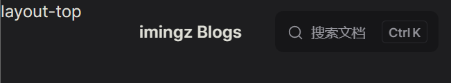
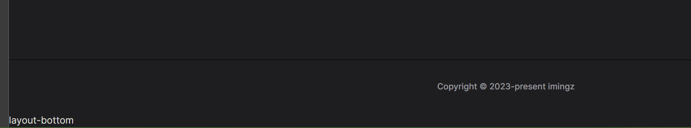
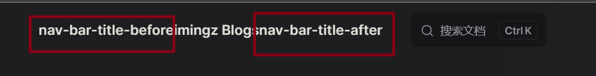
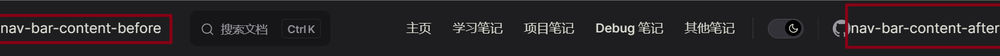
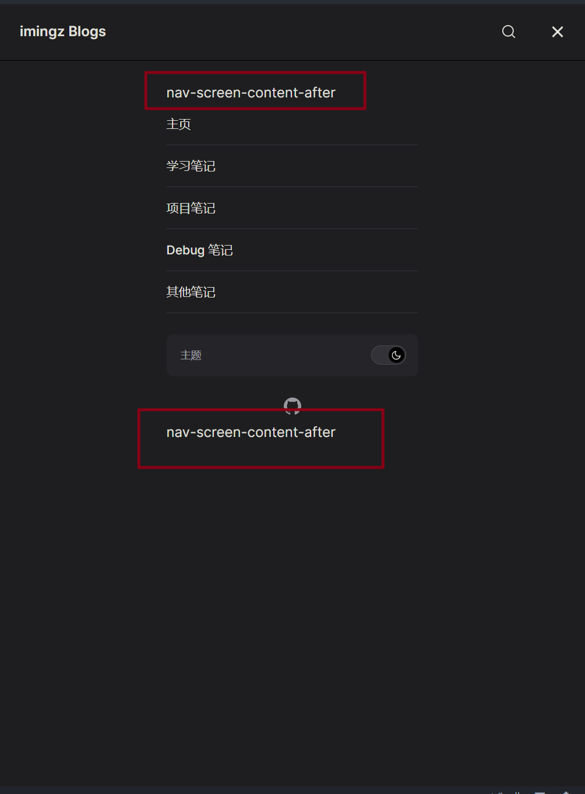
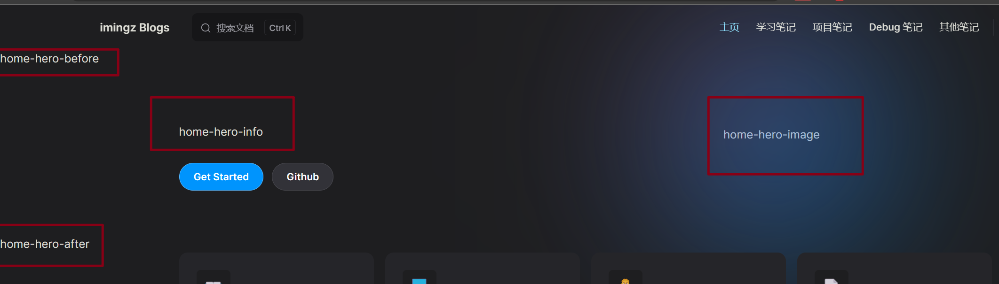
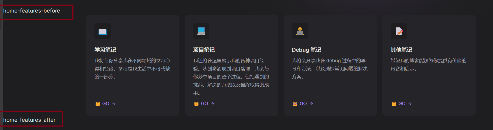

# VitePress 默认主题的布局槽

::: tip 注意
更新时间：2023/08/30

VitePress 版本: v1.0.0-rc.10
:::

:::details 参考
[官网](https://vitepress.dev/guide/extending-default-theme#layout-slots)
:::

默认主题的组件有几个插槽，可用于在页面的某些位置注入内容。

这里主要对默认主题布局中可用插槽的完整列表作一个简单图片辅助查看。

## 使用

有两种方式，使用 `#` [具名插槽](https://cn.vuejs.org/guide/components/slots.html#named-slots) 和 使用 `h()` [渲染函数](https://cn.vuejs.org/api/render-function.html#h)

**1. 使用具名插槽**

```vue
<!--.vitepress/theme/MyLayout.vue-->
<script setup>
import DefaultTheme from "vitepress/theme";

const { Layout } = DefaultTheme;
</script>

<template>
  <Layout>
    <template #aside-outline-before> My custom sidebar top content </template>
  </Layout>
</template>
```

```js
// .vitepress/theme/index.js
import DefaultTheme from "vitepress/theme";
import MyLayout from "./MyLayout.vue";

export default {
  ...DefaultTheme,
  // override the Layout with a wrapper component that
  // injects the slots
  Layout: MyLayout,
};
```

**2. 使用渲染函数**

```js
// .vitepress/theme/index.js
import { h } from "vue";
import DefaultTheme from "vitepress/theme";
import MyComponent from "./MyComponent.vue";

export default {
  ...DefaultTheme,
  Layout() {
    return h(DefaultTheme.Layout, null, {
      "aside-outline-before": () => h(MyComponent),
    });
  },
};
```

## 默认主题布局中可用插槽的完整列表：

### 全局

- `layout-top` 
- `layout-bottom` 
- `nav-bar-title-before`
- `nav-bar-title-after` 
- `nav-bar-content-before`
- `nav-bar-content-after` 
- `nav-screen-content-before`
- `nav-screen-content-after` 

### 主页 `layout: 'home'`

- `home-hero-before`
- `home-hero-info`
- `home-hero-image`
- `home-hero-after` 
- `home-features-before`
- `home-features-after` 

### 文档页（默认） `layout: 'doc'`

TODO：完善展示

- doc-top
- doc-bottom
- doc-footer-before
- doc-before
- doc-after
- sidebar-nav-before
- sidebar-nav-after
- aside-top
- aside-bottom
- aside-outline-before
- aside-outline-after
- aside-ads-before
- aside-ads-after

### 普通页 `layout: 'page'`

TODO：完善展示

- page-top
- page-bottom

### 404 页面

TODO：完善展示

- not-found
