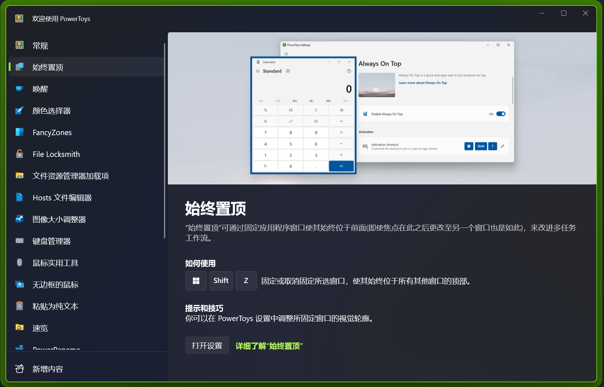
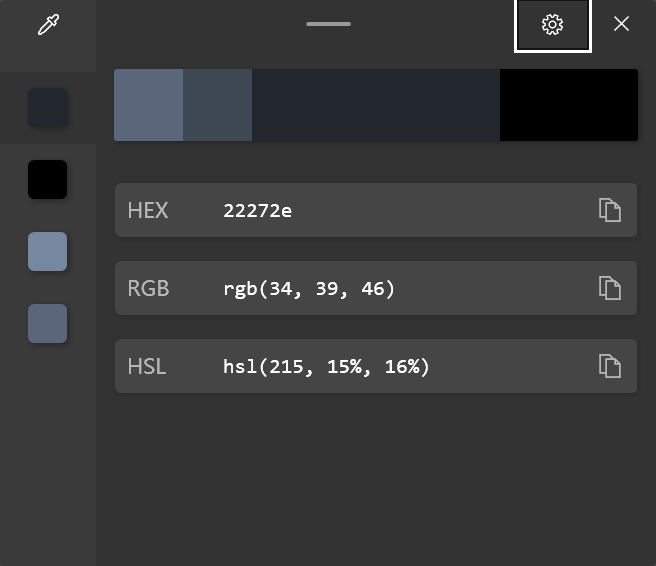
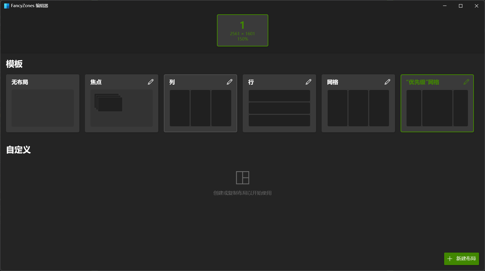
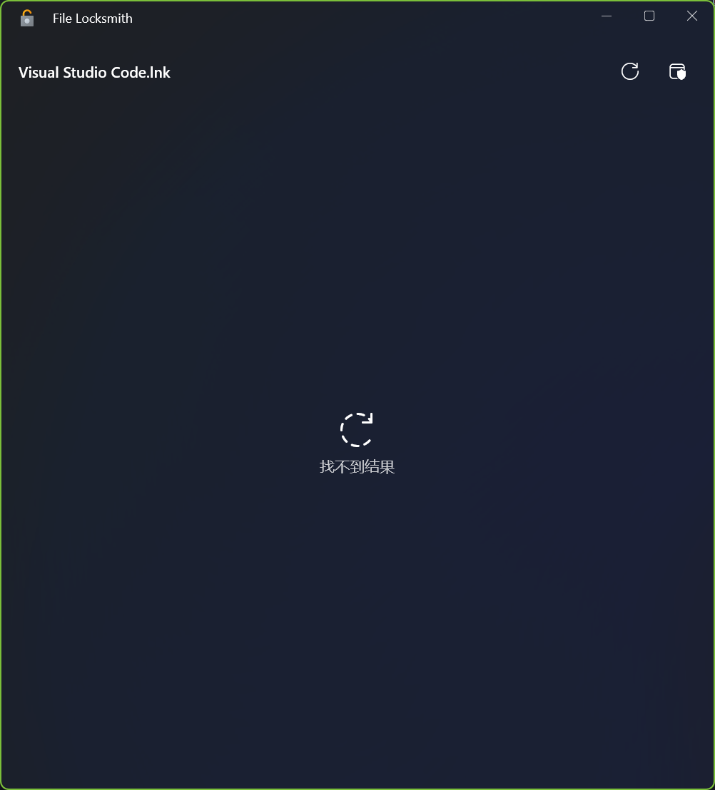
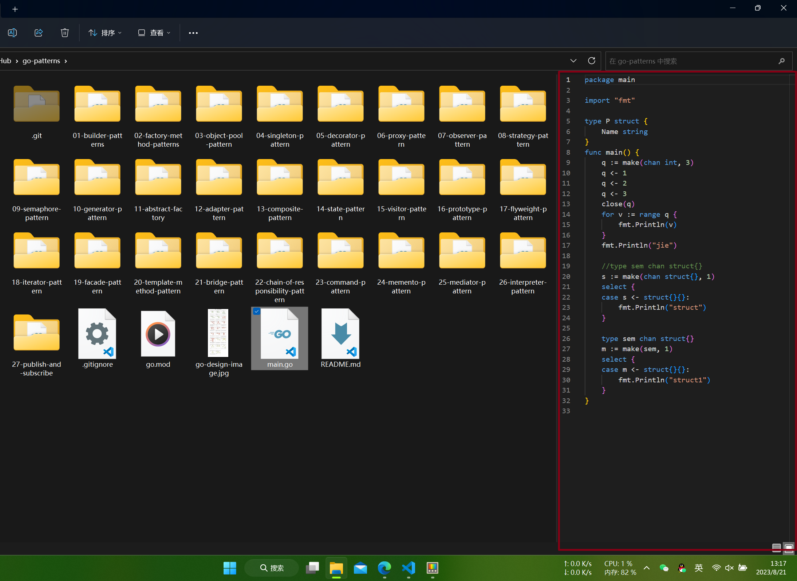
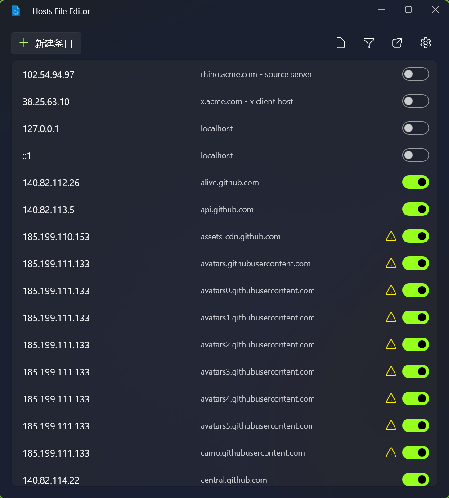
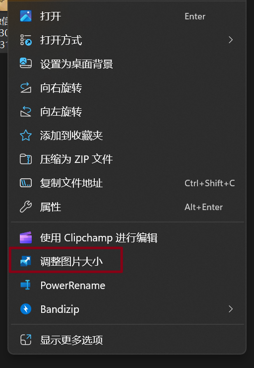
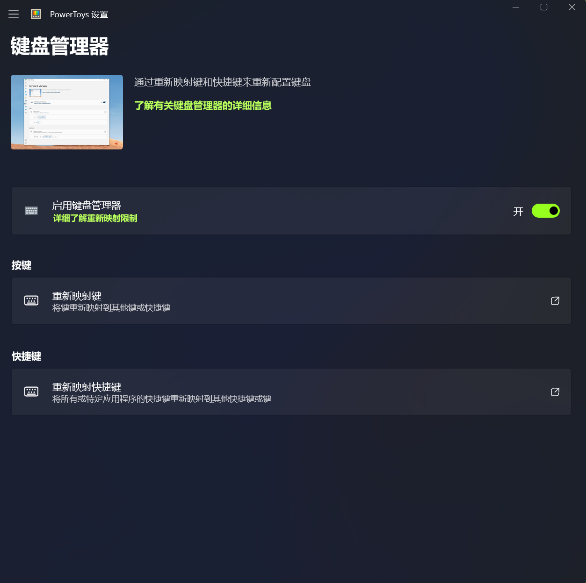
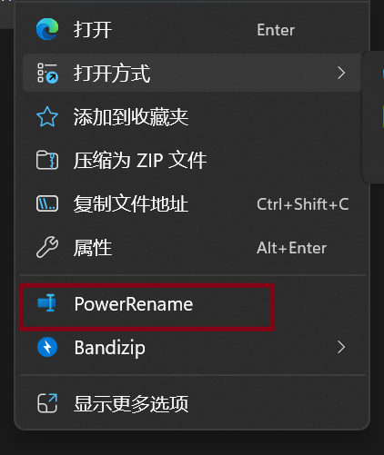

# PowerToys(Preview) 使用体验

:::info 版本
v0.72.0
:::

PowerToys 是微软发布于 Windows 平台的系统增强工具。

这里简单记录一下当前所有功能的使用体验。

## 始终置顶 Always on Top

使任意窗口置顶，按下快捷键指定当前窗口。

指定后会有加粗边框。

### 使用方式

`Win` + `Shift` + `Z`

### 效果

置顶前：

置顶后：

## 唤醒 PowerToys Awake

使计算机保持唤醒状态，且无需管理其电源和睡眠设置。

运行耗时较长的任务时，此行为非常有用，可确保计算机不会进入睡眠状态或关闭其显示屏。

### 效果

在有需要时打开软件设置。

打开后状态栏会有一个咖啡小图标

根据实际需要调整。

## 颜色选取器

颜色选取器是一种系统范围的颜色选取实用工具，通过 `Win` + `Shift` + `C` 进行激活。 从屏幕上的任意位置选取颜色，选取器会自动以设置的格式将颜色复制到剪贴板。 颜色选取器还包含一个编辑器，其中显示了之前选取的颜色的历史记录，你可用它来微调所选颜色并复制不同的字符串表示形式。

可以软件内自定义设置。

### 使用方式

`Win` + `Shift` + `C`

### 效果

## FancyZones

FancyZones 是一种窗口管理器，可用于轻松创建复杂的窗口布局，并将窗口快速放入到这些布局中。

### 使用方式

`Win` + `Shift` + `` ` ``

### 效果

## File Locksmith

是一个 Windows shell 扩展，用于检查哪些文件正在使用中以及由哪些进程使用。

### 使用方式

右键单击 File Explorer 中的一个或多个选定文件，然后选择“使用此文件的进程”。

### 效果

## 文件资源管理器 File Explorer

支持 File Explorer 中的预览窗格和缩略图呈现以显示各种文件类型。 若要启用预览窗格，请在 File Explorer 中选择“视图”选项卡，然后选择“预览窗格”。

### 效果

## Host 文件编辑器

快速打开 host 文件，简单编辑。

### 效果

## 图像大小调整器

快速调整图像大小的 Windows Shell 扩展。 只需在 File Explorer 中简单右键单击一下，立即就能调整一张或多张图像的大小。

### 效果

## 键盘管理器

通过键盘管理器，可重新映射键和创建自己的键盘快捷方式。

### 效果

## 鼠标实用工具

### 查找我的鼠标

默认使用 两次 `Ctrl`

### 鼠标荧光笔

使用键盘快捷键突出显示鼠标左键和鼠标右键单击。

`Win` + `Shift` + `H`

左键：

右键：

### 鼠标跳转

打开一个缩略图，快速跳转鼠标位置。

`Win` + `Shift` + `D`

### 鼠标十字线

绘制以鼠标指针为中心的十字线。

可能玩 cs 有用？

## 无边框鼠标

借助无边框鼠标，你可以使用同一个键盘和鼠标与多台计算机进行交互，在计算机之间无缝共享剪贴板内容和文件。

注：我没有多个设备，所有不可以测试。

## 粘贴为纯文本

以不带格式的方式粘贴剪贴板中的文本。

`Win` + `Ctrl` + `Alt` + `V`

## 速览

使用速览可以预览文件内容，而无需打开多个应用程序或中断工作流。 只需选择文件并使用快捷方式

`Ctrl` + `Space`

注：效果不如 QuickLook

## PowerRename

可执行批量重命名，搜索和替换文件名称。 它附带高级功能，例如使用正则表达式、面向特定文件类型、预览预期结果和撤消更改的能力。

## PowerToys Run

立即搜索和启动应用。

`Alt` + `Space`

### 集成 Everything

<https://github.com/lin-ycv/EverythingPowerToys/>

## 快速重音 Quick Accent

键入重音字符的替代方法。

## 注册表预览

可视化和编辑 Windows 注册表文件的实用工具。

## 屏幕标尺

可根据图像边缘检测快速测量屏幕上的像素。

`Win` + `Shift` + `M`

## 快捷键指南

显示桌面当前状态的可用快捷方式。

更改此设置，然后按住 `Win`

## 文本提取器(OCR)

从屏幕上任意位置复制文本的便捷方法。(不好用)

`Win` + `Shift` + `T`

## 视频会议静音

会议通话期间使用 ⊞ `Win` + `Shift` + `Q` 对麦克风和相机“全局”静音的一种快捷方式
